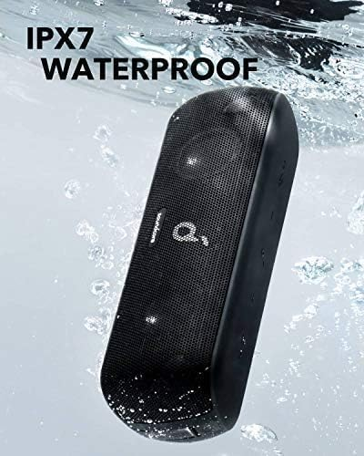
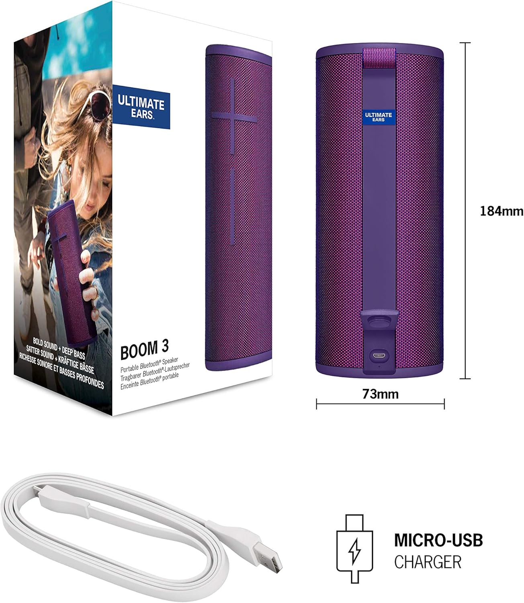

# Data Pre-processing (Sourcing for Data, extracting and loading it to a more recognizable format)

- Purpose: Collect and prepare Amazon reviews for Beats Pill Speaker and 11 competitors to enable sentiment analysis and comparisons.
- Approach: A data-driven workflow that starts with product selection, proceeds to scraping, and ends with data export-ready for analysis.

### Here is a quick overview of the steps I followed to gather data for this project:
1. Select Products: Find one Beats product and similar competitor products within similar price range with a good number of reviews.
2. Scrape Reviews: Use OxyLabs API to scrape the reviews.
3. Save Data: Download the reviews, load, convert and save them as a CSV file.

### Step 1: Data Sourcing - Finding Products to Review
        1. Identify Beats Product: I selected a beats product, 'Beats Pill Speaker' because it had lots f reviews (my aim was for at least 100 reviews, More reviews mean more data for my analysis!) on Amazon. I copied the URL from the address bar because it is my gateway to all those reviews.
        2. Identify Competitor Products: I selected 11 competitors who had similar products like the Beats pill Speaker, with similar price range, and a good number of reviews. I copied the URLs of these product pages.

### Step 2: Data Mining – Collecting Amazon Reviews

    **Overview**  
    - Purpose: Gather Beats Pill Speaker + 11 competitors' Amazon reviews for sentiment analysis and comparisons.  
    - Approach: Data-driven workflow to select products, scrape reviews, and save data for analysis.

    **High-level workflow**  
        1) Choose products  
        - Beats product: Beats Pill Speaker (Beats Pill Speaker is chosen for its large review volume to support robust analysis).
        - 11 competitor products with substantial reviews (target ~100+ per product) and price range similar to Beats pill (+$50 to -$50)

        2) Scrape reviews  
        - Use Oxylabs API by inputting product URLs  
        - Configure the request, Ensure parameters maximize data quality (ASIN, user agent, JS rendering off, parse enabled, domain .com, start page, pages up to 20)
        - Increase data collection if needed (more products or pages)
        - Export data as a JSON file for each product

    Safety and best practices
        - Mind the 5,000-request free tier
        - Avoid excessive random requests
        - Download and securely store final CSV files

### Step 3: Save the Data

    **Overview**
    Purpose: Prepare a final CSV of reviews for subsequent cleaning and analysis, and proceed to Pandas-based preprocessing.
    Approach: Using a jupyter notebook, load all json files and proceed with conversion to CSV file. 
    End Result: Save all collected reviews to a CSV file as the final deliverable for this step, containing the reviews for subsequent steps (data cleaning and analysis). Do not edit the raw data file after saving.

    1) load the JSON files on a Jupyter notebook by each product
    2) Compile data to CSV
        - Store the data frame as a CSV file.
        - Download the CSV file for safekeeping.
    3) Merge and finalize
        - Load multiple CSVs into data frames.
        - Merge data frames to concatenate all data.  
        - Export the final merged data frame to a single CSV for analysis.

    Safety and best practices
    - Download and securely store all final CSV files.

# All 12 Products used

## 1. Beats Pill 

Portable Bluetooth Speaker - Up to 24H Battery Life, Water Resistant, Bluetooth, Apple & Android Compatible, Seriously Loud Sound for Home, Outdoor and Travel - Matte Black

## 2. Altec Lansing

Altec Lansing Rockbox XL 2.0 Portable Bluetooth Wireless Speakers with Led Lights, IP67 Waterproof and Durable for Outdoor, 20 Hours Battery with App Control

## 3. Anker Soundcore

Anker Soundcore Motion+ Bluetooth Speaker with Hi-Res 30W Audio

## 4. Bang & Olufsen Beosound

Bang & Olufsen Beosound Explore - Wireless Portable Outdoor Bluetooth Speaker, IP 67 Dustproof and Waterproof, Anthracite

## 5. Bose SoundLink Flex

Bose SoundLink Flex Bluetooth Speaker, Portable Speaker with Microphone, Wireless Waterproof Speaker for Travel, Outdoor and Pool Use, Black

## 6. DOSS SoundBox Plus Bluetooth Speaker

DOSS SoundBox Ultra Bluetooth Speaker with 2.1 Channel Audio, 80W Superior Sound with Deep Bass, 18H Playtime, Sleek Design-Top White Elephant, Christmas & Birthday Gift for Men, Women, Parents-Grey

## 7. JBL Charge 5 Portable Bluetooth Speaker

JBL Charge 5 (Teal) + Bundle with divvi! Protective Hardshell Case (Black)

## 8. Marshall Emberton II Portable Bluetooth Speaker, Black & Brass

Marshall Emberton II Portable Bluetooth Speaker, Black & Brass

## 9. Sony SRS-XB33 Extra Bass Bluetooth Speaker 

Sony SRS-XB33 EXTRA BASS Wireless Bluetooth Portable Speaker, IP67 Waterproof & Durable for Home, Outdoor, and Travel, 24 Hour Battery, Party Lights, USB Type-C, and Speakerphone, Black

## 10. Sony SRS-XG300 X-Series Wireless Portable-Bluetooth Party-Speaker

Sony SRS-XG300 X-Series Wireless Portable-Bluetooth Party-Speaker IP67 Waterproof and Dustproof with 25 Hour-Battery and Retractable Handle, Black- New

## 11. Tribit StormBox Blast Portable Speaker

Tribit StormBox Blast Portable Speaker: 90W Loud Stereo Sound with XBass, IPX7 Waterproof Bluetooth Speaker with LED Light, Bluetooth 5.3&TWS, Custom EQ, 30H Playtime for Outdoor

## 12. Ultimate Ears Boom 3 Wireless Bluetooth Speaker

Ultimate Ears Boom 3 Wireless Bluetooth Speaker, Bold Sound + Deep Bass, Bluetooth, Magic Button, Waterproof, 15 Hours Battery, Range of 150 ft - Ultraviolet Purple

